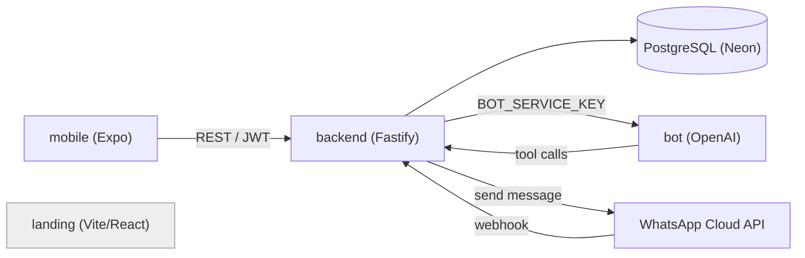
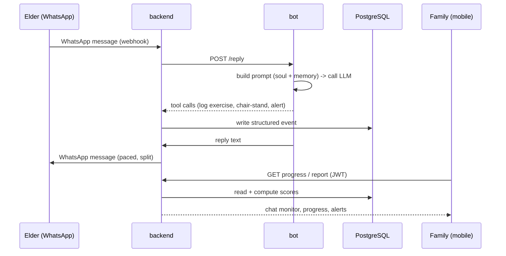

<h1 align="center">Lively</h1>


**A WhatsApp/Telegram companion that keeps elderly parents active and their family in the loop.**

Lively pairs an elderly person ("Eyang") with a friendly AI companion (Mbak Asih / Mas Budi) that texts daily check-ins, tracks a simple chair-stand fitness test, medication adherence, and exercise streaks — then reports a plain-language progress summary to the adult child through a companion mobile app. The elder never sees scores, streaks, or gamification UI; that layer exists only for the family member watching from the mobile app.

Built for **Garuda Hacks 7.0** (Health track).

> This is a monorepo — one clone gets all four services (`backend`, `bot`, `mobile`, `landing`), merged in via `git subtree` from their original repos ([backend](https://github.com/LivelyHub/lively-backend) · [bot](https://github.com/LivelyHub/lively-bot) · [mobile](https://github.com/LivelyHub/lively-mobile) · [landing](https://github.com/LivelyHub/lively-landing)).

---

## Table of Contents

- [Demo](#demo)
- [Screenshots](#screenshots)
- [Features](#features)
- [Tech Stack](#tech-stack)
- [Getting Started](#getting-started)
- [Architecture](#architecture)
- [Data Flow](#data-flow)
- [Gamification](#gamification)
- [Testing](#testing)
- [Performance Targets](#performance-targets)

---

## Demo

*(tbd — add demo video/link here)*

## Screenshots

*(tbd — add screenshots from mobile app + landing page here)*

---

## Features

### Core

- **AI companion chat** (`bot`) — persona-driven replies over WhatsApp: `backend` owns the WhatsApp Cloud API webhook and delivery pacing, `bot` is a stateless reply engine (`POST /reply`, `POST /soul`, `POST /medications`) that builds a per-elder system prompt and calls OpenAI (OpenRouter fallback).
- **Elder & family accounts** (`backend`) — JWT-authenticated family members own one or more elder profiles.
- **Chair-stand assessment** — 30-second chair-stand test results logged and scored as a fall-risk/fitness proxy.
- **Medication tracking** — medication list + per-dose logging, rolled up into an adherence score.
- **Exercise streaks** — daily exercise check-ins tracked as a consecutive-day streak.
- **Alerts** — safety escalation (missed day, medication missed, pain/dizziness mention, no-response, emergency) surfaced through `backend`'s alerts module.
- **Titipan** — family-to-elder message relay through the companion.
- **Family app** (`mobile`) — companion setup wizard, read-only chat monitor, progress charts, medications, alerts, and a weekly/monthly report screen for the family member — never shown to the elder.
- **Marketing site** (`landing`) — single-scroll pitch page: problem, how-it-works, companion preview, CTA.

### Not yet implemented

- Push notification delivery for alerts (alert records exist; device push is not wired).
- Automated test coverage on `backend` and `mobile` (see [Testing](#testing)).

---

## Tech Stack

| Component | Status | Stack |
|---|---|---|
| `backend` | implemented — WhatsApp webhook, bot integration, all modules wired; no automated tests | TypeScript (ESM) · Fastify 5 · Drizzle ORM · PostgreSQL (Neon) · Zod · bcryptjs · `@fastify/jwt` |
| `bot` | implemented — stateless HTTP reply service, no platform code of its own | TypeScript · `node:http` · OpenAI SDK (OpenAI + OpenRouter fallback) · better-sqlite3 · pino |
| `mobile` | implemented — auth, setup wizard, chat monitor, progress, medications, alerts, titipan, reports | Expo SDK 54 · React Native 0.81 · TypeScript · expo-router · TanStack Query |
| `landing` | implemented — static pitch page | Vite · React 19 · TypeScript · React Compiler |

All four repos are MIT-licensed and share a common contract doc (`CORE.md`) copied across them.

---

## Getting Started

```bash
git clone https://github.com/LivelyHub/lively.git
```

Everything is in one clone. Set up each component individually — see its own README for details:

**backend**
```bash
cd backend
npm install
cp .env.example .env   # DATABASE_URL, BOT_SERVICE_KEY, JWT_SECRET, PORT, WHATSAPP_* , META_APP_SECRET
docker compose up -d   # local Postgres on :5433
npm run db:generate && npm run db:migrate
npm run dev
```

**bot**
```bash
cd bot
npm install
cp .env.example .env   # OPENAI_API_KEY / OPENROUTER_API_KEY, BACKEND_API_URL, BOT_SERVICE_KEY
npm run dev
```

**mobile**
```bash
cd mobile
npm install
cp .env.example .env   # BACKEND_API_URL
npm start
```

**landing**
```bash
cd landing/lively-landing
npm install
npm run dev
```

---

## Architecture



`landing` is fully static and makes no backend calls — shown standalone above.

- **backend** is the shared brain: neither `mobile` nor `bot` talk to the database directly.
- Two auth modes on the backend: family-member JWT (mobile) and a static `BOT_SERVICE_KEY` header (bot, service-to-service) — both wired and in use.
- **bot** is stateless per call: it holds no platform connection, loads elder soul/memory from its own SQLite store, and calls back into `backend` for anything that needs to be logged or escalated.
- **landing** is fully static — no auth, no backend calls, no CMS.

---

## Data Flow



1. Elder sends or receives a WhatsApp message — `backend` owns the WhatsApp Cloud API webhook, pacing, and delivery.
2. `backend` calls `bot`'s `POST /reply` with the elder's message; `bot` loads the elder's soul + memory, calls the LLM (OpenAI, OpenRouter fallback), and may call tools back into `backend` (exercise logs, chair-stand results, alerts) using `BOT_SERVICE_KEY`.
3. Elder reports a chair-stand test, exercise, or medication dose — logged as a structured event.
4. `backend` computes derived signals at read time (no extra tables): chair-test score, exercise-streak score, medication-adherence score → averaged into `overall_progress_pct`.
5. Family member opens the `mobile` app (JWT-authenticated) to read the chat monitor, progress charts, and weekly/monthly report — pulled from `backend`.
6. `backend`'s alerts module records missed days, missed medication, concerning messages, or no-response — surfaced to `mobile`; device push delivery is not yet wired.

---

## Gamification

Progress mechanics exist **only for the family member's view** — the elder never sees a score, streak, or badge.

- `overall_progress_pct` = average of three sub-scores:
  - **Chair-test score** = `latest_reps / 15 * 100`
  - **Exercise score** = `current_streak_days / 7 * 100`
  - **Medication score** = `last_7d_taken / last_7d_scheduled * 100`
- `engagement_streak_days` — consecutive days the elder engaged with the companion.
- Chart-ready history for chair tests, exercise, and medication adherence, plus a `GET /elders/:id/report?period=week|month` summary endpoint.
- Explicit product rule (`mobile/docs/UI-UX-GUIDELINES.md`): no leaderboards, no badges, no "beat yesterday" framing toward the elder — the app frames this as a warm status readout for the family, not a game for the elder.

---

## Testing

| Component | Current state |
|---|---|
| `backend` | No automated tests wired yet (`npm test` is a placeholder). `docs/TESTING.md` specifies a planned Vitest + Fastify `app.inject()` suite per route, against a local Docker Postgres. |
| `bot` | `node:test` suite covering the HTTP server (`npm test`). |
| `mobile` | No automated tests; `docs/TESTING.md` specifies a manual per-screen QA checklist (skeleton/empty/error/offline/live states) run on physical devices via Expo Go, plus a scripted demo-day rehearsal. |
| `landing` | No tests, no CI. |

None of the four repos have CI configured (`.github/workflows` absent everywhere) as of this writing.

---

## Performance Targets

- API endpoints: **<500ms** warm response (`backend`).
- Alert delivery: **<10s** from triggering event to push (`backend`, `mobile`).
- Mobile cold start: **<3s** to first screen.
- Mobile chat live update: **≤10s**.
- No loading spinner visible for **>~2s** in the demo path; no fetch left un-timed-out past 10s.
- Screens must remain usable at **130% OS font scaling**.
- Bot typing delay: computed at 40 chars/sec, capped between 2–8s, to feel human rather than instant.

Scoped out for this hackathon build (see `backend/SPEC.md`): rate limiting, abuse protection, multi-region replication — single Neon instance, trusted two-client system.

---

<div align="center">

Built for Garuda Hacks 7.0 · Health track

</div>
